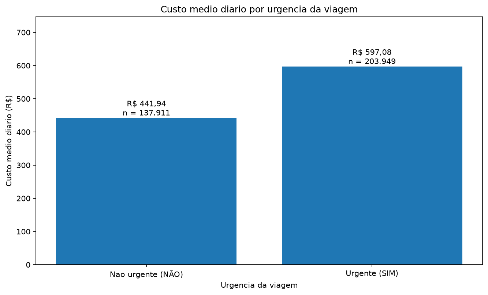
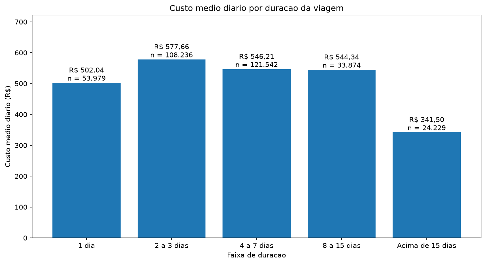
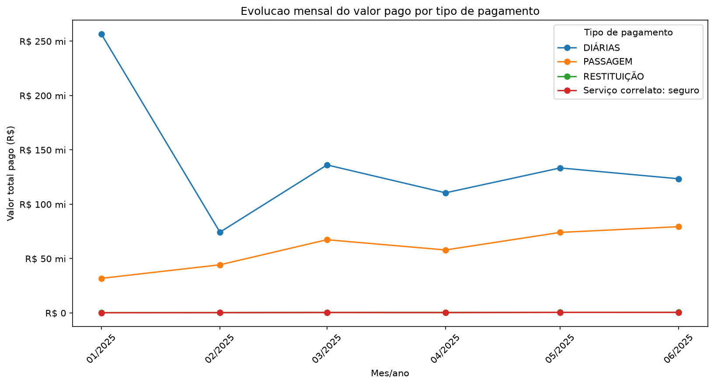
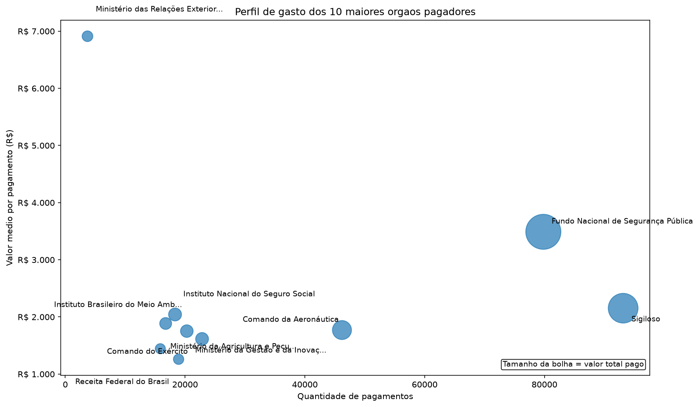

# ETL de Viagens a Serviço do Governo Federal

Projeto de pipeline ETL com dados públicos de viagens a serviço, utilizando PostgreSQL e Python e organizando o processamento em camadas Raw, Silver e Gold para análise e geração de gráficos.

## Sobre o projeto

Este projeto trabalha com dados públicos de viagens a serviço do Governo Federal referentes a 6 meses de 2025. O pipeline contempla a extração dos arquivos brutos, a carga na camada Raw, a transformação para a camada Silver, a consolidação analítica na camada Gold e, por fim, a execução de análises com geração de gráficos e apresentação acadêmica em notebook.

Fluxo resumido:

Extração  
→ Raw  
→ Transformação  
→ Silver  
→ Gold  
→ Análises e gráficos

O objetivo central é transformar dados brutos em informações estruturadas, consistentes e analíticas, preservando a origem dos dados e viabilizando consultas de negócio sobre gastos com viagens oficiais.

## Problema e objetivo

Os dados brutos de viagens públicas apresentam informações distribuídas entre arquivos distintos de:

- viagens;
- pagamentos;
- passagens;
- trechos.

Esse formato dificulta a análise direta, tanto pela fragmentação da informação quanto pela necessidade de limpeza, tipagem e consolidação dos registros.

O objetivo do projeto é:

- automatizar a extração dos arquivos;
- preservar os dados originais na camada Raw;
- limpar e tipar os dados na camada Silver;
- garantir integridade referencial entre as tabelas;
- consolidar pagamentos em uma camada Gold;
- responder perguntas de negócio com base em SQL analítico;
- gerar visualizações adequadas para apresentação dos resultados.

## Arquitetura da solução

```text
Google Drive / ZIP
        ↓
      4 CSVs
        ↓
    Camada Raw
        ↓
   Camada Silver
        ↓
    Camada Gold
        ↓
 Análises e gráficos
```

Resumo das etapas:

- `Google Drive / ZIP`: origem do arquivo compactado com os dados públicos.
- `4 CSVs`: arquivos de viagens, pagamentos, passagens e trechos.
- `Camada Raw`: cópia fiel da origem, sem tipagem analítica e sem constraints.
- `Camada Silver`: limpeza, tipagem, aplicação de chaves e validações.
- `Camada Gold`: consolidação analítica orientada a perguntas de negócio.
- `Análises e gráficos`: consultas finais com interpretação descritiva, gráficos e notebook acadêmico.

## Tecnologias utilizadas

Tecnologias identificadas no projeto:

- Python
- PostgreSQL
- psycopg2
- pandas
- matplotlib
- python-dotenv
- gdown
- Git
- GitHub
- pgAdmin
- PyCharm

## Estrutura do projeto

```text
etl-viagens-governo/
│
├── data/
│   ├── extracted/
│   ├── processed/
│   └── raw/
│
├── docs/
│   └── images/
│
├── notebooks/
│   └── 3_analise.ipynb
│
├── output/
│   ├── pergunta_1_viagens_urgentes.png
│   ├── pergunta_2_duracao_viagem.png
│   ├── pergunta_3_evolucao_pagamentos.png
│   └── pergunta_4_perfil_orgaos_pagadores.png
│
├── sql/
│   ├── 0_criar_banco.sql
│   └── 3_criar_gold.sql
│
├── src/
│   ├── 1_extrair.py
│   ├── 2_transformar.py
│   ├── 3_analisar.py
│   ├── __init__.py
│   ├── banco.py
│   ├── config.py
│   └── utils.py
│
├── tests/
│   └── __init__.py
│
├── .env
├── .env.example
├── .gitignore
├── README.md
└── requirements.txt
```

## Camada Raw

A camada Raw representa a cópia fiel da origem. Nela:

- os CSVs são carregados sem alteração de conteúdo;
- todas as colunas são `VARCHAR`;
- não existem constraints nas tabelas Raw;
- a finalidade é preservar os dados brutos exatamente como foram recebidos.

Tabelas da camada Raw:

- `raw_viagem`
- `raw_pagamento`
- `raw_passagem`
- `raw_trecho`

O script `src/1_extrair.py` é responsável por:

- baixar o ZIP do Google Drive;
- extrair os CSVs esperados;
- criar ou validar a estrutura necessária no banco;
- carregar os dados em blocos (`chunks`);
- executar `TRUNCATE` antes da carga, garantindo idempotência na camada Raw.

A camada Raw não realiza transformação analítica dos dados.

## Camada Silver

A camada Silver é construída pelo script `src/2_transformar.py`, responsável por transformar Raw → Silver.

Principais operações realizadas:

- limpeza de espaços com `BTRIM`;
- conversão de textos para `DATE`;
- conversão de valores monetários para `DECIMAL`;
- conversão de sequências para `INTEGER`;
- aplicação de chaves primárias;
- aplicação de chaves estrangeiras;
- aplicação de `CHECK`, `UNIQUE` e `NOT NULL`;
- validações de integridade referencial.

Tabelas da camada Silver:

- `silver_viagem`
- `silver_pagamento`
- `silver_passagem`
- `silver_trecho`

Colunas calculadas documentadas:

- `valor_total`  
  Fórmula:

  ```text
  valor_diarias
  + valor_passagens
  + valor_outros_gastos
  - valor_devolucao
  ```

- `duracao_dias`  
  Fórmula atual:

  ```text
  (data_fim - data_inicio) + 1
  ```

A duração, portanto, é inclusiva, contando tanto a data de início quanto a data de fim.

### Idempotência e segurança transacional

O pipeline foi estruturado para permitir execuções repetidas com comportamento consistente:

- a Raw é truncada antes de nova carga;
- a Silver é truncada antes da transformação;
- as operações são executadas de forma controlada dentro de transações;
- em caso de erro ocorre `rollback`;
- execuções repetidas sobre a mesma fonte produzem resultados consistentes.

Na transformação da Silver, o processo também trata de forma breve a possibilidade de bloqueios (`lock`) por sessões concorrentes, informando o problema caso o acesso exclusivo às tabelas não esteja disponível.

Volumes validados da camada Silver:

| Tabela | Registros |
|---|---:|
| silver_viagem | 341.860 |
| silver_pagamento | 606.916 |
| silver_passagem | 167.260 |
| silver_trecho | 763.349 |

Para a base oficial analisada, as quantidades da Raw e Silver ficaram equivalentes após a transformação.

## Camada Gold

Na estrutura final da Fase 3, três artefatos coexistem com responsabilidades distintas:

- `sql/3_criar_gold.sql`: criação e materialização da camada Gold;
- `src/3_analisar.py`: implementação programática das análises e dos gráficos;
- [`notebooks/3_analise.ipynb`](notebooks/3_analise.ipynb): apresentação acadêmica e interativa da etapa analítica.

O arquivo `sql/3_criar_gold.sql` é responsável por:

- criar a tabela `gold_resumo_pagamentos_mensais`;
- carregar e materializar a Gold;
- criar a view `vw_resumo_pagamentos_mensais`;
- executar validações entre tabela e view e conferir totais financeiros.

A camada Gold consolida dados de:

- `silver_viagem`
- `silver_pagamento`

Agrupamento da Gold:

- ano;
- mês;
- órgão pagador;
- tipo de pagamento.

Colunas da Gold:

- `ano_referencia`
- `mes_referencia`
- `nome_orgao_pagador`
- `tipo_pagamento`
- `qtd_viagens`
- `qtd_pagamentos`
- `valor_total_pago`
- `valor_medio_pagamento`

### Tabela e View

`gold_resumo_pagamentos_mensais` é uma tabela materializada no momento da execução do SQL. Já `vw_resumo_pagamentos_mensais` recalcula os dados sempre que é consultada.

As duas estruturas foram comparadas com `EXCEPT` e retornaram `0` divergências. Além disso, as contagens e o total financeiro também foram comparados entre a Gold e a Silver para validar a consistência da consolidação.

Valores validados na base utilizada no projeto:

- registros na tabela Gold: `3.348`;
- registros na View Gold: `3.348`;
- total pago na Gold: `R$ 1.194.365.457,37`;
- total correspondente na Silver: `R$ 1.194.365.457,37`;
- divergências TABLE x VIEW: `0`.

### Script de análise

O arquivo `src/3_analisar.py` é responsável por:

- implementar programaticamente as quatro perguntas de negócio;
- centralizar as consultas SQL da Fase 3;
- consultar e validar os DataFrames analíticos;
- gerar os quatro gráficos em `output/`;
- produzir as análises textuais com base nos resultados calculados.

### Notebook de análise

O notebook [`notebooks/3_analise.ipynb`](notebooks/3_analise.ipynb) é o artefato de apresentação acadêmica e interativa da Fase 3.

Ele organiza sequencialmente:

1. conexão com PostgreSQL;
2. verificação da existência da Gold;
3. validações da tabela e da View;
4. Pergunta 1;
5. Pergunta 2;
6. Pergunta 3;
7. Pergunta 4;
8. conclusões.

O notebook reutiliza a lógica validada de `src/3_analisar.py` e não recria automaticamente a Gold. Caso a Gold ainda não exista no PostgreSQL, ele orienta a executar primeiro `sql/3_criar_gold.sql`.

## Perguntas de negócio

As quatro perguntas de negócio implementadas no projeto são:

1. Quais viagens urgentes custam mais por dia do que as não urgentes?
2. Como o custo médio diário varia conforme a duração da viagem?
3. Como o valor pago evoluiu mês a mês e qual tipo de pagamento sustenta essa evolução?
4. Qual é o perfil de gasto dos órgãos pagadores?

### Pergunta 1 — Viagens urgentes custam mais por dia?

Resultados validados:

Não urgente:

- 137.911 viagens;
- duração média: 7,31 dias;
- valor total médio: R$ 2.954,75;
- custo médio diário: R$ 441,94.

Urgente:

- 203.949 viagens;
- duração média: 8,57 dias;
- valor total médio: R$ 3.827,69;
- custo médio diário: R$ 597,08.

Indicadores consolidados:

- diferença absoluta: R$ 155,14;
- diferença percentual: 35,10%;
- participação das urgentes: 59,66%.

Conclusão: as viagens urgentes apresentam custo médio diário superior e representam a maioria das viagens analisadas.



### Pergunta 2 — Como o custo médio diário varia conforme a duração?

Resultados por faixa:

- `1 dia`: R$ 502,04 | 53.979 viagens
- `2 a 3 dias`: R$ 577,66 | 108.236 viagens
- `4 a 7 dias`: R$ 546,21 | 121.542 viagens
- `8 a 15 dias`: R$ 544,34 | 33.874 viagens
- `Acima de 15 dias`: R$ 341,50 | 24.229 viagens

Leituras principais:

- o maior custo médio diário ocorre em `2 a 3 dias`;
- o menor custo médio diário ocorre em `Acima de 15 dias`;
- viagens mais longas apresentam menor custo diário no final da distribuição;
- não há trajetória monotônica desde a primeira faixa.



### Pergunta 3 — Evolução mensal dos pagamentos

Período analisado:

- `01/2025` a `06/2025`

Resultados consolidados:

- janeiro: R$ 288.751.443,90;
- junho: R$ 203.937.334,69;
- variação entre primeiro e último mês: -29,37%;
- maior valor mensal: janeiro/2025;
- menor valor mensal: fevereiro/2025.

Composição por tipo:

- `DIÁRIAS`: 88,81% em janeiro;
- `DIÁRIAS`: 60,52% em junho;
- `PASSAGEM`: ganho de 27,90 pontos percentuais entre janeiro e junho;
- `DIÁRIAS`: perda de 28,29 pontos percentuais no mesmo intervalo.

Acumulado do período:

- `DIÁRIAS`: R$ 834.352.643,52
- participação no total: 69,86%

Os dados mostram variações mensais relevantes, mas seis meses não são suficientes para confirmar sazonalidade recorrente.



### Pergunta 4 — Perfil de gasto dos órgãos pagadores

Principais resultados:

- maior valor total pago: `Fundo Nacional de Segurança Pública` — R$ 278.481.047,89;
- maior quantidade de pagamentos: `Sigiloso` — 93.141 pagamentos;
- maior ticket médio: `Ministério das Relações Exteriores - Unidades com vínculo direto` — R$ 6.911,03;
- maior quantidade agregada de viagens atendidas: `Sigiloso` — 62.400;
- menor ticket médio dentro do Top 10: `Receita Federal do Brasil` — R$ 1.258,71.

Os perfis foram classificados de forma relativa ao Top 10, usando as medianas de quantidade de pagamentos e de valor médio por pagamento. Isso permite distinguir, de forma descritiva, órgãos com:

- alto volume / ticket baixo;
- baixo volume / ticket alto.

Nota metodológica: como a Gold está agregada por mês, órgão e tipo de pagamento, `SUM(qtd_viagens)` pode contar uma mesma viagem em mais de um grupo quando há diferentes tipos de pagamento.



## Como executar

### Pré-requisitos

- Python
- PostgreSQL
- pgAdmin (opcional)
- Git

### Dependências

O projeto possui `requirements.txt`. Instale as dependências com:

```bash
pip install -r requirements.txt
```

### Configuração

Configure o arquivo `.env` com as variáveis abaixo:

```env
DB_HOST=
DB_PORT=
DB_NAME=
DB_USER=
DB_PASSWORD=
DRIVE_FILE_ID=
```

### Ordem de execução

1. Preparar banco e tabelas  
   Executar:

   ```sql
   sql/0_criar_banco.sql
   ```

2. Extrair e carregar Raw

   ```bash
   python src/1_extrair.py
   ```

3. Transformar Raw → Silver

   ```bash
   python src/2_transformar.py
   ```

4. Criar/materializar Gold  
   Executar:

   ```sql
   sql/3_criar_gold.sql
   ```

5. Executar as análises programaticamente

   ```bash
   python src/3_analisar.py
   ```

6. Abrir o notebook acadêmico  
   Arquivo:

   [`notebooks/3_analise.ipynb`](notebooks/3_analise.ipynb)

O notebook pode ser executado com `Restart Kernel` → `Run All`, desde que:

- o ambiente Python esteja configurado;
- o PostgreSQL esteja acessível;
- a Gold já tenha sido criada previamente.

Os gráficos serão gravados em `output/`.

## Resultados esperados

Após a execução completa, a estrutura esperada do projeto inclui:

- 4 tabelas Raw;
- 4 tabelas Silver;
- 1 tabela Gold;
- 1 View Gold;
- 4 gráficos;
- 1 notebook analítico documentado.

## Versionamento

O desenvolvimento foi dividido em branches por etapa:

- `feature/database-setup`
- `feature/raw-extraction`
- `feature/silver-transformation`
- `feature/gold-analysis`

A branch `feature/gold-analysis` concentra a implementação da camada Gold, das análises em Python, da geração dos gráficos e do notebook acadêmico da Fase 3.

## Melhorias futuras

- ampliar o período analisado;
- automatizar a execução completa do pipeline;
- criar logging estruturado;
- criar testes automatizados;
- adicionar índices conforme crescimento da base;
- criar dashboard analítico;
- automatizar a atualização da Gold;
- aprofundar a análise de sazonalidade com mais períodos.

## Conclusão

O projeto demonstrou a construção de um pipeline ETL completo com modelagem em camadas Raw, Silver e Gold, uso de PostgreSQL e Python, transformação orientada por integridade de dados, agregações analíticas, notebook acadêmico de apresentação e visualização de indicadores públicos.

Os principais resultados mostram que viagens urgentes possuem custo diário superior, que o custo médio diário varia de forma não monotônica conforme a duração, que o valor pago apresentou variações mensais no período analisado e que os órgãos pagadores exibem perfis distintos de volume e ticket médio. Em conjunto, esses resultados mostram como um pipeline bem estruturado permite transformar dados públicos brutos em informação analítica útil para interpretação e comunicação de indicadores.
